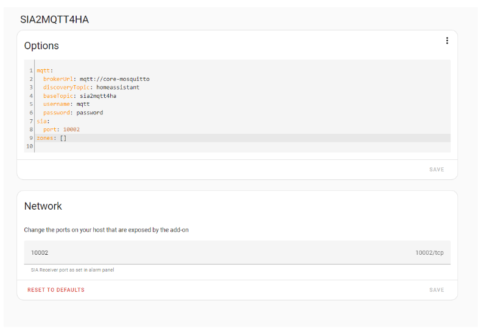
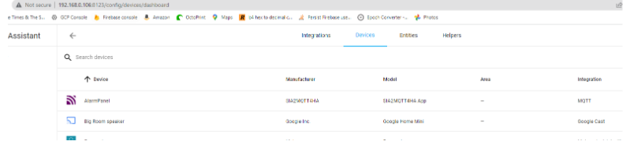

# Getting started with SIA2MQTT4HALast updated: 15 June 2025

## Introduction

SIA2MQTT4HA is a Home Assistant addon that functions as an SIA alarm monitor that creates
and updates Home Assistant entities with the status of a Honeywell alarm panel. This page
describes how to get this add-on running on Home Assistant. It doesn’t detail advanced use
through Home Assistant automations etc.

I’ll run through these steps, some will not be necessary if you are already using Home Assistant:

1. Install Home Assistant
2. Install and configure Samba file sharing addon
3. Install and configure Mosquitto MQTT broker addon
4. Download, build and configure SIA2MQTT4HA addon
5. Configure Honeywell alarm panel

## Install Home Assistant

Follow instructions that start here: https://www.home-assistant.io/installation/
I have tested with both Home Assistant Operating System for Raspberry Pi as an SD card image
on a Raspberry Pi 3 and Home Assistant Operating System for Linux as a virtual machine image
under Hyper-V on a Windows desktop.

## Install Samba

Using the Home Assistant web interface, go to Settings, then Add-ons, then click ADD-ON
STORE. Click Samba Share from the Official add-ons section and install. When installed, click
Start and then click edit Edit Config.
Configure the Samba add-on by adding a username and password that you will use later. Click
Save to store the configuration.

Click the Info tab for the Samba add-on and then click Start again.

## Install Mosquitto Broker

Using the Home Assistant web interface, go to Settings, then Add-ons, then click ADD-ON
STORE. Click Mosquitto Broker from the Official add-ons section and install.
There is no need to change any configuration in the Mosquitto Configuration tab, but you do
need to create a username and password for a special system user account that will authenticate connections to Mosquitto. First you need to make sure your own account has "Advanced Mode" set to on. You do this by clicking your username at the bottom left of Home Assistant from any page:

Then select Advanced Mode:

Then add the new system user, do this by going to Settings, then People then click the Users tab, click ADD USER and enter something like the following (remember the username and password you enter):

Now start the Mosquitto addon from Settings->Add-ons->Mosquitto broker screen.
Finally for this step, Home Assistant needs to be configured to use the Mosquitto MQTT
broker. Go to Settings->Devices & Services and click on the MQTT Configure button as show
here:

Accept the next screen:

## Install SIA2MQTT4HA

Download a ZIP file for SIA2MQTT4HA from
https://github.com/666djb/SIA2MQTT4HA/archive/refs/heads/master.zip
Using Windows File Explorer or equivalent, browse to your Home Assistant’s Samba file share
by entering the address using the following form \\\a.b.c.d (where a.b.c.d is replaced by your
Home Assistant IP address) in the address bar, this will show the folders shared by Home
Assistant as follows:

Open the addons folder and unzip the contents of the ZIP file into here so that you have the
structure “addons\SIA2MQTT4HA-master\” as shown here:

To enable Home Assistant to recognise this folder as a new Add-ons repository, restart by
going to Settings, System and then click the "Power Symbol" in the top right, then open "Advanced Options" and select "Reboot System".
When Home Assistant has restarted, go back into Settings, Add-ons, Add-ons Store and you
will see a new Local Add-ons section with the SIA2MQTT4HA add-on available.
Click this and install it.
Configure SIA2MQTT4HA by clicking the Configuration tab, click the three dots in the top right
corner of the Options dialog box and select Edit in YAML. Now, replace the words “null” with
your MQTT username and password, and remove all text after the word “Zones:” and replace
with a space and two square brackets “[]” as shown here:

Save the configuration by clicking SAVE.
Note: you can add individual Zones if you are using them later, but for basic functionality you
do not need them.
Start the SIA2MQTT4HA add-on by going to the Info tab and clicking Start.
Check the Log tab to confirm that the add-on has started and that your configuration is good,
the output should look something like the following if all is good:

Browse to Settings, Devices & Services, Devices tab and you should see the AlarmPanel device
like:

Click on AlarmPanel and you will see the entities that have been created as a set of sensors:

These sensor entities can be shown in a Lovelace dashboard and used in Automations.

## Configure Alarm Panel

You now need to configure your Honeywell Alarm panel to send SIA messages to SIA2MQTT4HA. From your Alarm's keypad, enter Engineer Mode then follow each of these steps:

1. In menu 56.1.1.1.4.1 enter the IP addresss of Home Assistant and the port number for the SIA2MQTT4HA add-on which is 10002 by default
2. In menu 56.1.1.1.4.2 select SIA as the Format
3. In menu 56.1.1.1.4.2.1 select SIA level 3
4. In menu 56.1.1.1.4.3.1 enter your Autotest Interval (e.g. 01:00 for once per hour)
5. In menu 56.1.1.1.4.3.2 enter an Account Number (any numeric value)
6. In menu 56.1.2.1.1 enter the same Account Number (as in step 5)
7. In menu 56.1.2.1.2 enable the events to report (e.g. INTRUDER, FIRE, SETTING, PA/DISTRESS, FAULT etc.)
8. In menu 56.1.2.1.3 enter 1 for the RX sequence
9. In menu 56.3.3.5.1 disable encyption for Reports

When the Alarm Panel is configured correctly, it will send messages to the add-on in response
to triggers and the sensor entities will update in response. You can test this by
setting/unsetting the alarm for example, or by entering menu 56.7.1 to run a manual test.