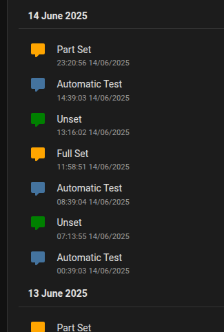

# SIA2MQTT4HA v0.2

## Description

Galaxy Flex Alarm Panel SIA to MQTT server for Home Assistant

This package is based on work from https://github.com/dklemm/FlexSIA2MQTT.git

I have modified the FlexSIA2MQTT package to better suit my needs:
* It can be installed as an add-on in Home Assistant or run standalone
* It is auto discoverable by Home Assistant
* It creates one device - the "AlarmPanel" which has five status entities:
  * sensor.alarmpanel_comms_status (Comms Status) ([example](./EntityExamples.md#comms-status-entity)) who's state is the text from the status attribute and has the following attributes:
    * status: text "Ok" or "Failed" - representing status of comms between the panel and an ARC (including SIA2MQTT4HA)
    * time: text - representing the time of the last update
    * ok: boolean - representation of status
  * sensor.alarmpanel_last_event (Last Event) ([example](./EntityExamples.md#last-event-entity)) who's state is the text from the status attribute and has the following attributes:
    * status: text - containing description of the last event reported
    * time: text - representing the time of the last update
  * sensor.alarmpanel_set_status (Set Status) ([example](./EntityExamples.md#set-status-entity)) who's state is the text from the status attribute and has the following attributes:
    * status: text "Unset", "Full Set" or "Part Set" - representing the set state of the panel
    * time: text - representing the time of the last update
    * unSet: boolean - representation of the Unset state
    * fullSet: boolean - representation of the Full Set state
    * partSet: oolean - representation of the Part Seet state
  * binary_sensor.alarmpanel_triggered (Triggered) ([example](./EntityExamples.md#triggered-entity)) who's state is boolean off or on representing whether the alarm is triggered and has the following attribute:
    * time: text - representing the time of the last update
  * sensor.alarmpanel_event (Event) ([example](./EntityExamples.md#event-entity)) who's state is the text from the code attribute and has the following attributes:
    * accountId: text - containing the account ID used to connect to SIA2MQTT4HA
    * time: text - representing the time of the last update
    * groupModifier: text - from the panel's SIA message (see the Flex Installer's manual for details of these seven attributes)
    * peripheralModifier: text - from the panel's SIA message
    * userModifier: text - from the panel's SIA message
    * vaModifier: text - from the panel's SIA message
    * code: text - containing the panel's raw SIA message code
    * zone: text - from the panel's SIA message
    * text: text - from the panel's SIA message describing the raw SIA message code
* If Zones are configured in the config file, and the alarm panel is set to log open/close state of these (via CUSTOM-A/B and assemble zones menu), then the status of these is reported in Home Assistant (e.g. to trigger automations etc.).

I have only tested with:
* Galaxy Flex 100+ with v3 firmware and Ethernet Module A083-00-02

It should work with:
* Galaxy Flex 20, 50 or 100 with v3 Firmware
* Galaxy Flex Ethernet Module A083-00-02

https://www.security.honeywell.com/uk/All-Categories/intruder-detection-systems/control-panels/galaxy-flex-series

# Changes
Note, that v0.2 makes changes to the entities and attributes that are discovered by Home Assistant. The new entity/attribute details are above.
Any automations you have based on the old (earlier than v0.2) entites/attributes will need editing. I think the new entites/attributes make automation
a lot easier and remove some duplication.

See [Changelog](./CHANGELOG.md)

# How to Get Started

See [Getting Started with SIA2MQTT4HA](./GettingStarted.md)

# Running stand alone without Docker

First convert the Typescript to Javascript: "tsc -p ./src"
Then run: "npm start"

# Docker

Build from the command line (e.g. not in Home Assistant): "docker build -t sia2mqtt4ha:latest --build-arg BUILD_FROM=alpine ."

Run: "docker run -v /config.yml:/config.yml -p 10002:10002 sia2mqtt4ha"

* Change the -p to reflect the port number you have configured in your Galaxy Flex panel

# To do

* Fix configuration for when sia2mqttt4ha is run stand alone (at present you need to put config in /data/options.json or redefine the CONFIG_FILE constant in server.ts)
* Add a guide on how to create a logging dashboard for panel events that looks like:

* Look at implementing encrypted event reporting from the panel
* Look at SIA level 4 control and polling
